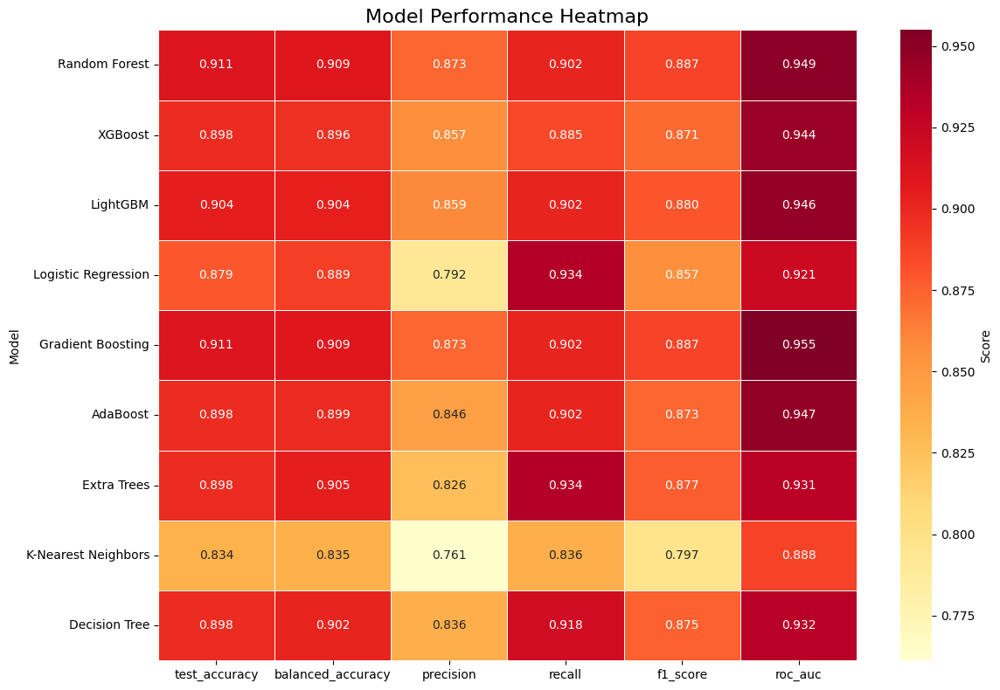
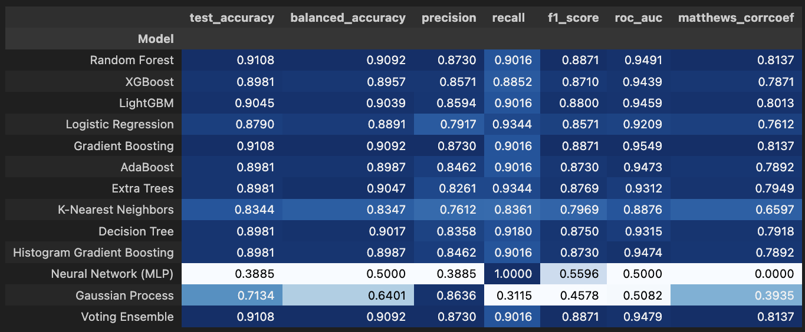

# Multi-Model-Machine-Learning-Approach-for-Tsunami-Risk-Assessment

# 🌊 Tsunami Prediction Model

*A machine learning approach to predict tsunami occurrences based on seismic and geographical data.*

---

## 📋 Overview

This project implements a complete machine learning pipeline for predicting potential tsunami occurrences following seismic events. Using both geological and seismic parameters, multiple models were trained and evaluated to determine the likelihood of tsunami generation.

The system includes data preprocessing, feature engineering, model benchmarking, evaluation, and inference utilities — making it suitable for research, analytics, and potential integration into early-warning frameworks.

---

## 🎯 Key Features

- ✅ **Comparison of 12+ ML models**
- 📊 **Detailed model evaluation metrics**
- 🧠 **Robust feature engineering and preprocessing**
- 🔁 **Production-ready prediction pipeline**
- 🌍 **Real-time tsunami risk estimation**

---

## 📊 Dataset Features

| Feature | Description |
|--------|-------------|
| `magnitude` | Richter scale magnitude of the earthquake |
| `cdi` | Community Decimal Intensity (perceived impact) |
| `mmi` | Modified Mercalli Intensity (shaking severity) |
| `sig` | Significance score of the event |
| `depth` | Depth of earthquake (km) |
| `latitude`, `longitude` | Geographic coordinates |
| `dmin` | Distance from epicenter to nearest station |
| `year`, `month` | Time-based features for seasonal patterns |

---

## 🏆 Model Performance (Top Models)

  

  

| Model | Accuracy | Balanced Accuracy | F1-Score | ROC-AUC | MCC |
|------|---------|------------------|---------|---------|-----|
| **Gradient Boosting** | **0.9108** | **0.9092** | **0.8871** | **0.9549** | **0.8137** |
| **Random Forest** | **0.9108** | **0.9092** | **0.8871** | 0.9491 | **0.8137** |
| **Voting Ensemble** | **0.9108** | **0.9092** | **0.8871** | 0.9479 | **0.8137** |
| LightGBM | 0.9045 | 0.9039 | 0.8800 | 0.9459 | 0.8013 |

